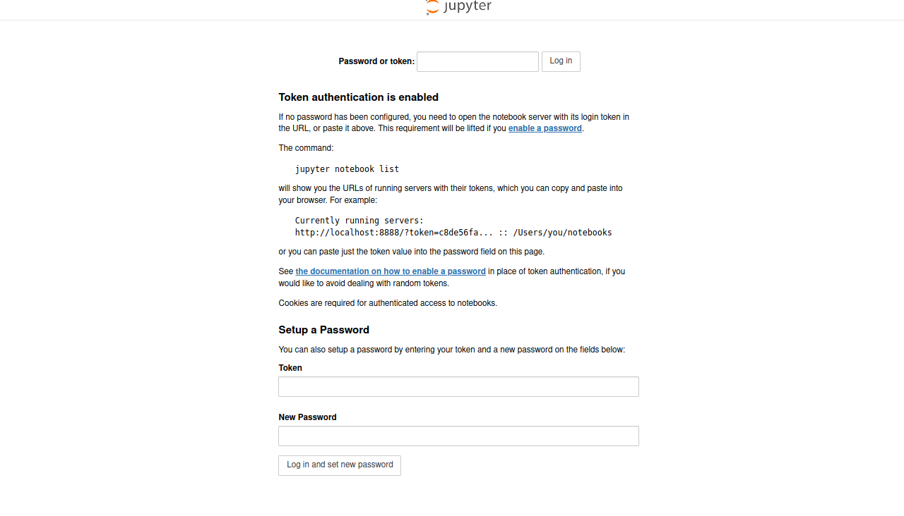

# Jupyter with GPU on Nero

## Nero

If you want to run forward on Nero, you can first generate the login credential for
your ssh configuration file by doing:

```bash
/bin/bash hosts/nero_ssh.sh
```
It will ask you for your username, and then give a snippet of code to copy into your
`~/.ssh/config` file. It should prompt you for your password and two step the first time,
and then work to login with just `ssh nero`. On Nero, you will also need to ensure that 
you have the nbserverproxy module installed. To install packages from pypi, you'll
need this pip settings file exists in your $HOME folder:

```bash
~/.pip/pip.conf
```

Within in you need to define this mirror:

```
[global]
index-url = https://nero-mirror.stanford.edu/pypi/simple
```

And then install the needed Python3 software for the notebook:

```bash
pip3 install nbserverproxy --user
```

Now let's generate our params.sh file that will specify using nero, and wanting a GPU.
Do this via [setup.sh](setup.sh) to generate a params.sh file that looks like:

```
FORWARD_USERNAME="vsochat"
PORT="49153"
PARTITION="gpu"
RESOURCE="nero"
MEM="20G"
TIME="8:00:00"
CONTAINERSHARE="/scratch/users/vsochat/share"
GRES="gpu:1"
```

You can edit the defaults (e.g., time and memory) to be what fits your needs.
Now let's run the script to launch our node! By default the notebook home
will be our home directory, and we will load anaconda 3 and launch a notebook
on the port specified.

```bash
bash start.sh nero/py3-jupyter
```

You'll see information and instructions stream to the screen.

```

== View logs in separate terminal ==
ssh nero cat /home/vsochat/forward-util/py3-jupyter.sbatch.out
ssh nero cat /home/vsochat/forward-util/py3-jupyter.sbatch.err

== Instructions ==
1. Password, output, and error printed to this terminal? Look at logs (see instruction above)
2. Browser: http://sh-02-21.int:8888/ -> http://localhost:8888/...
3. To end session: bash end.sh nero/py3-jupyter
```

In the example above, we are forwarding port 8888 from our local machine. We would
then open this up to see:



Remember that we need a password! This is actually echoed into the error stream, so
we would issue the following command to get it:

```bash
ssh nero cat /home/vsochat/forward-util/py3-jupyter.sbatch.err
```

When you are ready to clean up:

```bash
$ bash end.sh nero/py3-jupyter
```
